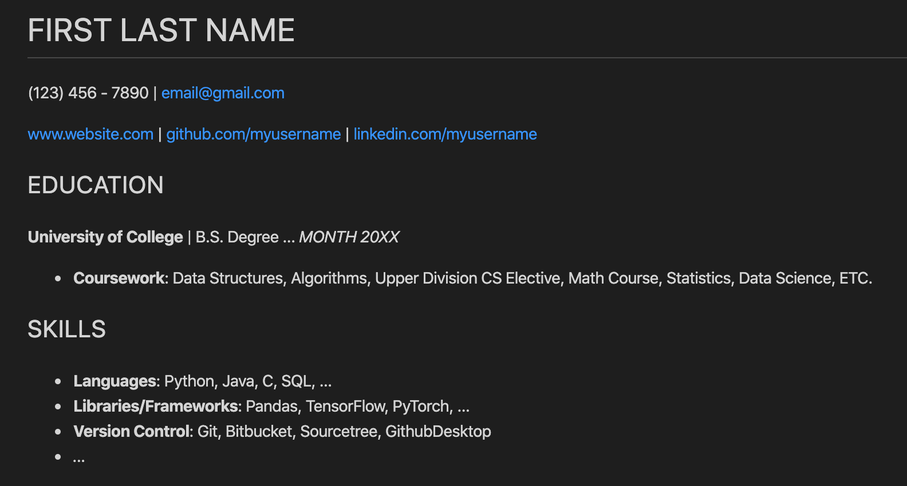
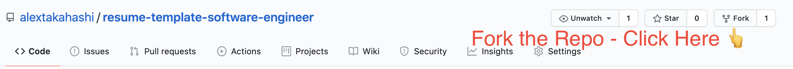
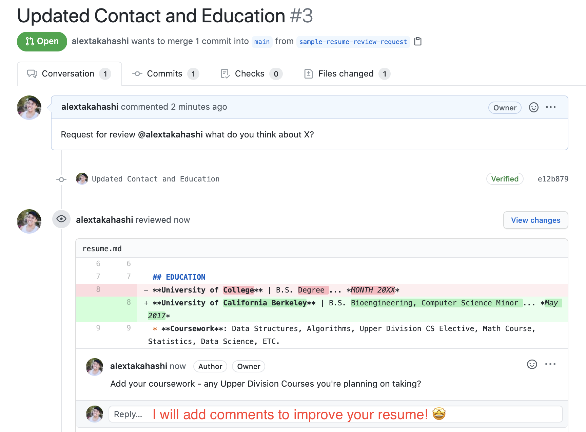

# 📝 Software Engineer Resume *Content* Template

> TL;DR - **Content Template** for your Software Engineering Resume.  Structure your experiences to **emphasize impact** and **convince the reader why you're a prime candidate**.  Make a Pull Request to request for a review form me 😁!

Resumes have the highest *False Negative* Rate of the entire recruitment process.  You can be a qualified engineer, but miscommunicate and lose interest from the reader.  Let's close the gap to **keep resumes engaging and lead to the next step of recruitment**!

## 🔨 How to Use this Template + Request Feedback

1. ✅ Fork this repo - [Documentation](https://docs.github.com/en/free-pro-team@latest/github/getting-started-with-github/fork-a-repo)

2. ✅ Update `resume.md` with your resume content.
3. ✅ Create a Pull Request to *request feedback*

4. ✅ Receive Feedback!

> Disclaimer - user personal contact sparigingly!  Please feel free to leave contact information as dummy content.

## 🤔 Why Use this Repo?

* **Resumes are formulaic** - Recruiters are looking to answer 1 fundamental question 

> Does the candidate have the background to succeed in the techincal interview?

* **Compose Engaging Content** - Draw attention to your experience and accomplishments to catch the eye of your reader.
* **Prioritize Impactful Experiences** - Put your best foot forward and hook the reader early why you're the best candidate.

## 👑 Content is King

> Why a Content Template?

* **Content First, Style Later**: Format and style is important, but content is the only thing that will push you to the next round.
* **Persuade the Reader**: Refined bullet points will quickly convince the reader *why* you're a great candidate.

## 🔊 Resume Feedback

* **Scalable Peer Feedback** - get more eyes from your peers by utilizing git pull requests.
* **Request Feedback from Professionals** - Ask for feedback from people outside your immediate network!
* **Feedback from me** - I will provide feedback for people who make pull requests 😁

## 👋 About Me

I've been on both sides of recruitment by now - submiting resumes + reviewing them.  I've seen hundereds of resumes of aspiring engineers.  Hoping to push folks in the right direction to get their foot into the door for Software Engineering Recruitment!
